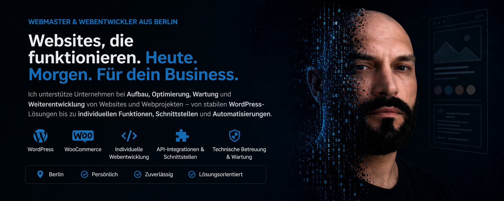
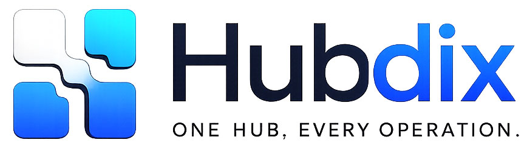

  

  # Vitaliy Shmidt

  ### Software Architect · SaaS Founder · Full-Stack Engineer

  **I turn complex business processes into reliable software products.**

  
  
  

---

[About](#about) · [Products](#selected-products) · [Enterprise](#enterprise-experience) · [Expertise](#expertise) · [Technology](#technology) · [Contact](#contact)

## About

For more than **20 years**, I have designed and developed enterprise software, SaaS platforms and business intelligence solutions.

I work across the complete technical lifecycle — from product concept, software architecture and UX to databases, backend, frontend, APIs, integrations, deployment, operations and continuous product evolution.

My focus is not technology for its own sake. I build systems that remain useful, maintainable and reliable in real business environments.

### How I create value

- Design scalable SaaS and enterprise platforms
- Build multi-tenant business applications
- Architect databases, APIs and system integrations
- Translate complex business processes into maintainable software
- Automate operational workflows with n8n and AI integrations
- Lead products from concept and UX to production and long-term operation

---

# Selected products

## RntLink

  

### Hospitality operations in one connected platform

RntLink is a hospitality SaaS for hotels and holiday apartments. It combines calendar synchronization, housekeeping, maintenance, revenue workflows, owner reporting and operational coordination.

`Hospitality SaaS` `PHP` `Vue.js` `MySQL` `iCal` `REST API`

---

## HubDix

  

### Infrastructure, services and automation

HubDix is an operations and hosting platform for managing infrastructure, shared services and automated workflows across multiple digital products.

`Operations` `Automation` `Laravel` `Docker` `Linux` `API`

---

## JumpQR

  

### Scalable QR management and analytics

JumpQR is a multi-tenant QR SaaS for creating, organizing and analyzing QR codes, including asset management, click statistics and REST API access.

`QR SaaS` `Laravel` `Vue.js` `Analytics` `REST API`

---

## Adresser

  

### Structured address and location data management

Adresser is a web application for creating, organizing and maintaining structured address-related data and location-based records.

`Web Application` `Data Management` `Addresses` `Open Source`

---

# Currently building

## ChronoDix

### Next-generation business intelligence platform

ChronoDix is the technical successor to CHRONOS. It is being designed as a multi-tenant platform for snapshot-based planning, structured imports, forecasting, budgeting and open API integrations.

`BI Platform` `Laravel` `Vue.js` `PostgreSQL` `Docker` `REST API`

> Most product repositories are private. This profile presents selected capabilities and product context without exposing confidential source code or business information.

---

# Enterprise experience

## CHRONOS — Enterprise BI & Performance Management

I was the **original software architect and technical product lead** of a multilingual enterprise platform for budgeting, forecasting, financial planning, KPI reporting, management reporting and operational performance management in the hospitality industry.

### Production impact

- **260+ hotels** supported
- **500+ users** across operational environments
- **10+ countries** in productive use
- Multi-tenant financial data across multiple years and planning versions
- Automated integrations with hotel, finance, accounting and third-party systems

### Technical responsibility

I was responsible for the complete technical lifecycle of the platform: product concept, software architecture, UX, database architecture, backend, frontend, business logic, reporting engine, REST APIs, integrations, deployment, infrastructure, security, performance optimization and continuous development.

---

# Expertise

### Architecture & Platforms

`Software Architecture` `SaaS Platforms` `Enterprise Applications` `Multi-Tenant Systems`

### Business Systems

`Hospitality Technology` `Business Intelligence` `FP&A` `Financial Reporting`

### Engineering & Operations

`Database Architecture` `API Design` `Workflow Automation` `Deployment` `Infrastructure` `Operations`

### Product & Innovation

`Product Strategy` `Process Digitalization` `AI Integration` `Technical Product Leadership`

---

# Technology

### Application development

### Data & APIs

### Infrastructure & automation

---

# Engineering principles

> **Software should not only work. It should create measurable value.**

- Prefer clear architecture over accidental complexity
- Design for maintainability, observability and long-term operation
- Automate repetitive processes whenever it improves reliability
- Keep product decisions close to real user and business needs
- Build systems that can evolve without losing stability

---

# Contact

For software architecture, SaaS product development, technical partnerships or selected freelance projects:

### [info@webmaster-vitaliy.de](mailto:info@webmaster-vitaliy.de)

