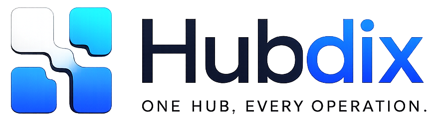

# Vitaliy Shmidt

### Software Architect · SaaS Founder · Full-Stack Engineer

I build software products that simplify complex business operations.

For more than 20 years, I have designed and developed enterprise software, SaaS platforms and business intelligence solutions — from architecture and database design to APIs, deployment, operations and product strategy.

---

| 20+ Years | 10+ Years | 260+ Hotels | 500+ Users | 10+ Countries | 3 Live Products |
|:---:|:---:|:---:|:---:|:---:|:---:|
| Experience | Technical Product Leadership | Enterprise Reach | Active Users | International Use | SaaS Portfolio |

## What I do

- Design scalable SaaS and enterprise platforms
- Build multi-tenant business applications
- Architect databases, APIs and integrations
- Translate complex business processes into maintainable software
- Automate workflows with n8n and AI integrations
- Own products from concept and UX to deployment and long-term operation

## Live products

<table>
<tr>
<td width="50%" valign="top">

### [RntLink](https://rntlink.com/) · Live

Hospitality SaaS for hotels and holiday apartments. The platform combines calendar synchronization, housekeeping, maintenance, revenue workflows, owner reporting and operational coordination.

`Hospitality SaaS` `PHP` `Vue.js` `MySQL` `iCal` `REST API`

</td>
<td width="50%" valign="top">

### [HubDix](https://hubdix.com/) · Live

Operations, hosting and automation platform for managing services, infrastructure and shared workflows across multiple digital products.

`Operations` `Automation` `Laravel` `Docker` `Linux` `API`

</td>
</tr>
<tr>
<td width="50%" valign="top">

### [JumpQR](https://jumpqr.com/) · Live

Multi-tenant QR SaaS for creating, managing and analyzing QR codes, including click statistics, asset management and REST API access.

`QR SaaS` `Laravel` `Vue.js` `Analytics` `REST API`

</td>
<td width="50%" valign="top">

### ChronoDix · In development

Next-generation BI platform and technical successor to CHRONOS. Built as a multi-tenant system with snapshot-based planning, import workflows, forecasting, budgeting and an open API layer.

`BI Platform` `Laravel` `Vue.js` `PostgreSQL` `Docker` `REST API`

</td>
</tr>
</table>

> Most product repositories are private. This profile presents selected capabilities and product context without exposing confidential source code or business information.

## Enterprise experience

### CHRONOS — Enterprise BI & Performance Management

Original software architect and technical product lead of a multilingual enterprise platform for budgeting, forecasting, financial planning, KPI reporting, management reporting and operational performance management in the hospitality industry.

The system has been operated in production for more than ten years and supported:

- **260+ hotels**
- **500+ users**
- **10+ countries**
- multi-tenant financial data across multiple years and planning versions
- automated integrations with hotel, finance, accounting and third-party systems

I was responsible for the complete technical lifecycle of the platform: product concept, software architecture, UX, database architecture, backend, frontend, business logic, reporting engine, REST APIs, integrations, deployment, infrastructure, security, performance optimization and continuous development.

## Areas of expertise

`Software Architecture` `SaaS Platforms` `Enterprise Applications` `Multi-Tenant Systems`

`Hospitality Technology` `Business Intelligence` `FP&A` `Financial Reporting`

`Database Architecture` `API Design` `Workflow Automation` `AI Integration`

`Product Strategy` `Deployment & Operations` `Process Digitalization`

## Core technology

## Current focus

I am currently building and operating software products for hospitality, digital operations and business intelligence. My work combines software architecture, product thinking and automation to create systems that remain useful, maintainable and reliable in real business environments.

## Contact

For software architecture, SaaS product development, technical partnerships or selected freelance projects:

**[info@webmaster-vitaliy.de](mailto:info@webmaster-vitaliy.de)**

---

### Software should not only work. It should create measurable value.

